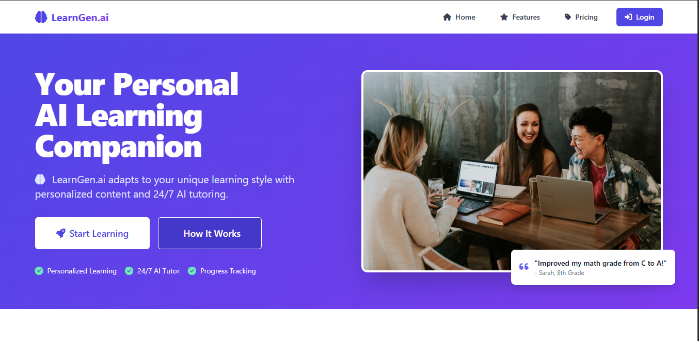

# LearnGenAI: AI-Powered Educational Tutor 🚀

[](https://opensource.org/licenses/MIT)
[](https://developer.mozilla.org/en-US/docs/Web/JavaScript)
[](https://tailwindcss.com/)

LearnGenAI is a **web-based AI tutor** that delivers personalized learning experiences using the **DeepSeek API**. Built with modern web technologies, it offers interactive lessons, real-time Q&A, and adaptive feedback for students and educators.

 
(assets/gen.PNG)

## ✨ Features
- **Interactive UI**: Clean, responsive interface built with **Tailwind CSS**.
- **Real-time AI Tutoring**: Powered by **DeepSeek API** for instant answers.
- **Subject Support**: Coding, Math, Science, and Languages.
- **No Backend Needed**: Pure frontend implementation (HTML/CSS/JS).

## 🚀 Quick Start

### Prerequisites
- Modern browser (Chrome/Firefox/Edge)
- DeepSeek API key ([Get yours here](https://platform.deepseek.com/))
- Live server (e.g., VS Code Live Server extension)

### Installation
1. Clone the repo:
   ```bash
   git clone https://github.com/yourusername/learngenai.git
